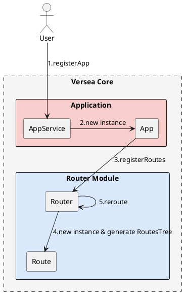

# 应用

### 应用注册流程

<!--

```plantuml
@startuml
actor User
rectangle "Versea Core" #F5F5F5;line.dashed {
  rectangle "Application" #F8CECC {
    rectangle "AppService"
    rectangle "App"
    AppService -> App: 2.new instance
  }
  rectangle "Router Module" #DAE8FC {
    rectangle "Router"
    rectangle "Route"
    Router -down-> Route: 4.new instance & generate RoutesTree
    Router -> Router: 5.reroute
  }
  Router <-up- App: 3.registerRoutes
}
AppService <-up- User: 1.registerApp
@enduml
```
-->

AppService 有一个重要的方法是 registerApp，registerApp 会生成 App 的实例，并把 registerApp 创建时传入的路由信息传给 Router 创建 Route 的实例，生成 RoutesTree。后续会用这个 RoutesTree 做路由匹配。
