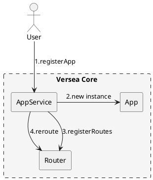

# App

前面已经说过 `App` 即子应用，App 是一个具有加载能力的对象。但 App 到子应用还有一段距离，这是[versea core 架构](./main.md) 里面遗留的问题，这里会解释清楚这个问题。另外这里会说明整个 App 的实现。

### App 和子应用

一个具有加载能力的对象怎么能做到渲染 Dom 呢？先看如下代码：

```ts
class App {
  constructor(config) {
    this.name = config.name;
    this.load = config.loadApp;
  }
}

function loadScript(url: string) {
  // 加载 js 资源文件
}

const foo = new App({
  name: 'foo',
  loadApp: () => {
    loadScript('https://xxx.xxx.xxx/xxx.js');
  },
});

// file: https://xxx.xxx.xxx/xxx.js
// document.getElementById('foo').innerHTML = '<div>hello world</div>'

foo.load();
```

`foo` 是 `App` 的一个实例，`foo` 具有加载能力，调用 `foo.load` 之后会加载 js 资源，js 资源内部就会生成 Dom。

那么，这个 load 方法便是关联 App 实例和子应用代码的的桥梁。

### 注册 App 和管理 App

```ts
class App {
  constructor(config) {
    this.name = config.name;
    this.load = config.loadApp;
  }
}

class AppService {
  appMap = {}

  registerApp(config) {
    this.appMap[config.name] = new App(config);
  }
}
```

一个简单的实现如上，`AppService` 是 App 的管理类，用于处理注册应用，获取应用实例等逻辑。App 是子应用实体，不再赘述。

### 加载与渲染

上面的实现非常简单，除此之外，我们还需要实现几个必须的功能。

1. 应用状态
2. mount 和 unmount，从 load 的返回值获取声明周期函数进行封装
3. 加载与渲染的函数参数

```ts
class App {
  constructor(config) {
    this.name = config.name;
    this._loadApp = config.loadApp;
    this.status = 'NotLoaded';
  }

  async load(context) {
    this.status = 'Loading';
    this._lifeCycle = await this._loadApp(this._getProps(context));
    this.status = 'NotMounted';
  }

  async mount(context) {
    this.status = 'Mounting';
    await this._lifeCycle.mount(this._getProps(context));
    this.status = 'Mounted';
  }

  async unmount(context) {
    this.status = 'Unmounting';
    await this._lifeCycle.unmount(this._getProps(context));
    this.status = 'NotMounted';
  }

  _getProps(context) {
    return {
      context,
      app: this,
    };
  }
}
```

### 关联 App 和 Router

App 和 Router 必须关联起来才知道在路由激活的时候渲染什么应用，因此我们在注册路由的时候传入 App 的实例。

```ts
class AppService {
  appMap = {}

  registerApp(config) {
    const app = new App(config);

    // 注册路由
    this._router.registerRoutes(config.routes, app);

    this.appMap[config.name] = app;
  }
}
```

### reroute

每次注册应用，其实都触发了应用和路由的变更，因此需要重新执行路由匹配和渲染应用逻辑，需要调用一次 reroute

```ts
class AppService {
  appMap = {}

  registerApp(config) {
    const app = new App(config);

    // 注册路由
    this._router.registerRoutes(config.routes, app);

    this.appMap[config.name] = app;

    this._router.reroute();
  }
}
```

### 应用注册流程图

<!--

-->


子应用注册流程图如上
