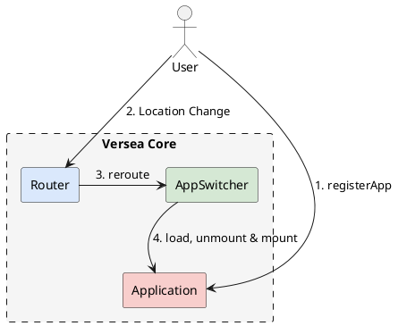

# versea 架构

### 流程

```plantuml
@startuml
actor User
rectangle "Versea Core" #F5F5F5;line.dashed {
  rectangle Application #F8CECC {
  }
  rectangle Router #DAE8FC {
  }
  rectangle AppSwitcher #D5E8D4 {
  }
  Router -> AppSwitcher: 3. reroute
  AppSwitcher --> Application: 4. load, unmount & mount
}
User --> Application: 1. registerApp
User --> Router: 2. Location Change
@enduml
```

1. 使用者首先注册应用
2. 路由切换时会触发 `router.reroute`
3. reroute 会调用 AppSwitcher 会执行切换应用
