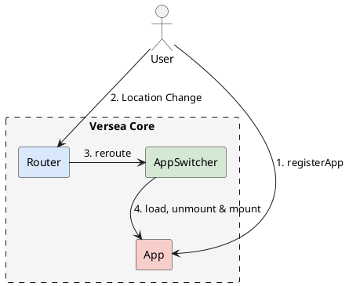

# versea core 架构

[简介](../introduction.md) 中已经介绍了整个 versea 的架构。

versea core 是 versea 的核心能力，`App`，`Router` 和 `AppSwitcher` 是 versea 的骨架，versea core 还包含这三者之间的调用关系。

### 流程

<!--

-->


1. 注册应用
2. 路由切换时会触发 `router.reroute`
3. reroute 会调用 `AppSwitcher` 的 switch 方法切换 `App`
4. `AppSwitcher` 根据匹配的应用执行 load, unmount, mount

### App

`App` 即子应用，App 是一个具有加载能力的对象。

```ts
const foo = {
  name: 'foo',
  load: async () => {
    return Promise.resolve();
  },
};

const bar = {
  name: 'bar',
  load: async () => {
    return Promise.resolve({
      mount: async () => {
        console.log('mount');
        return Promise.resolve();
      },
      unmount: async () => {
        console.log('unmount');
        return Promise.resolve();
      },
    });
  },
};
```

上面的 `foo` 和 `bar` 都是 App。这里可能会有点疑惑，没有执行子应用的代码，没有渲染子应用 Dom，离我们认识的微前端的子应用好像有点差距。

versea core 的核心逻辑是处理各个 `App` load, mount, unmount 的时序，至于如何执行子应用的代码，如何渲染子应用 Dom，这并不是 versea core 关心的内容。

### Router

versea `Router` 不同于 `ReactRouter` 和 `VueRouter`。`ReactRouter` 和 `VueRouter` 决定了当前页面应该展示哪些组件，versea `Router` 决定了当前页面应该展示哪些应用。可以理解 `ReactRouter` 和 `VueRouter` 是 Component Router, 而 versea `Router` 是 App Router。因此，主应用可能同时具有 Component Router 和 App Router，子应用只有 Component Router。

### AppSwitcher

`AppSwitcher` 比较简单，页面切换的时候，AppSwitcher 先销毁当前展示的应用，然后渲染切换之后匹配到的应用。
