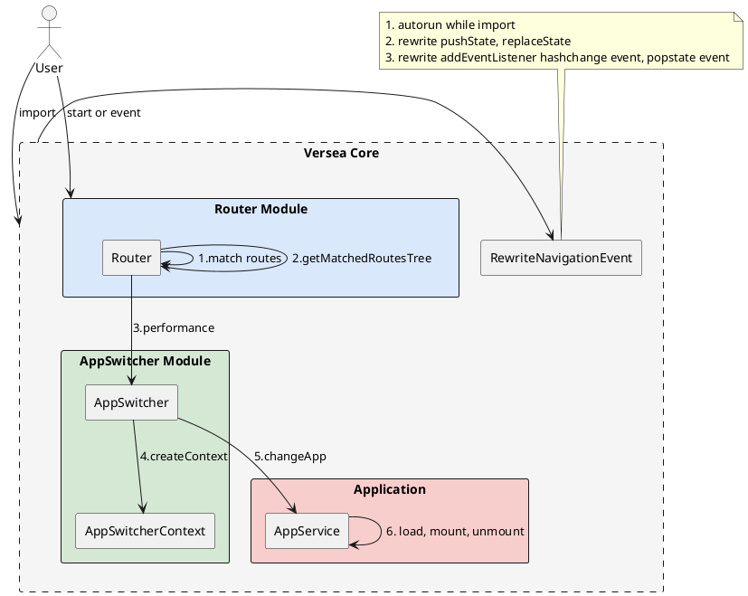

# 路由

### reroute 流程

<!--

-->

reroute 流程较为复杂，是整个 versea/core 的核心，控制整个应用加载，卸载流程，这里重点介绍一下 AppSwitcherContext，它需要记录 App 的加载顺序，mount 顺序和卸载顺序。当 changeApp 触发时，会生成一个新的 AppSwitcherContext。然后销毁当前的 AppSwitcherContext，使用新的 AppSwitcherContext 替代它。
