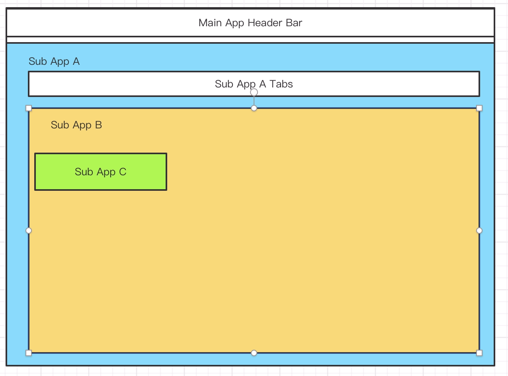
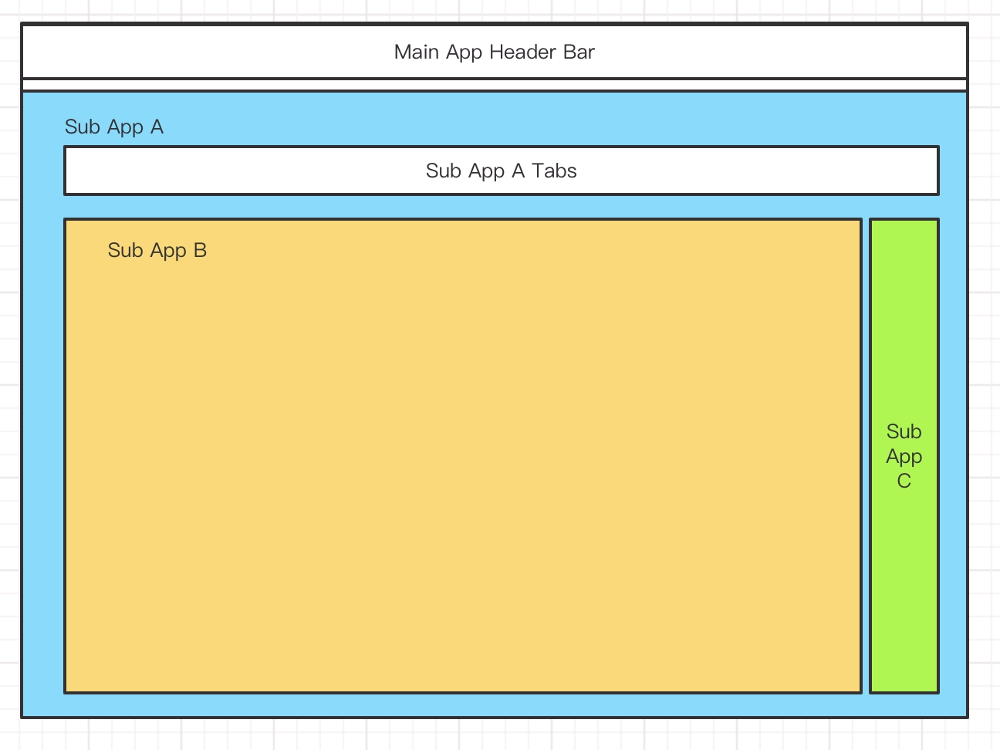

# 碎片和路由合并

之前留了一个疑问，[apps](./basic.md) 是一个数组，为什么一个路由，会对应多个应用。我们会解释这个问题。

我们先看如下两个页面，路由和页面结构参考[上文](./nested-routes.md)

- case1



B 应用不具有嵌套路由的能力，没有声明 slot，但是希望在访问 `/foo/bar` 的时候能渲染 C 应用。C 应用在 B 内部。

- case2



B 应用不具有嵌套路由的能力，没有声明 slot，但是希望在访问 `/foo/bar` 的时候能渲染 C 应用。C 应用在 B 外部，但都在 A 应用下。

### 路由合并

假设 A 应用，B 应用和 C 应用都注册了 routes. 结果如下：

```ts
const routes = [
  {
    path: '/foo',
    slot: 'foo-container1'
    apps: [A]
  },
  {
    path: '/bar',
    fill: 'foo-container1'
    apps: [B],
    children: [
      {
        path: '/baz',
        apps: [B],
      }
    ]
  },
  {
    path: '/bar',
    apps: [C],
  }
]
```

C 的 `/bar` 路由也要插入 `/foo` 作为 children。

```ts
const routes = [
  {
    path: '/foo',
    slot: 'foo-container1'
    apps: [A]
  },
  {
    path: '/bar',
    fill: 'foo-container1'
    apps: [B],
    children: [
      {
        path: '/baz',
        apps: [B],
      }
    ]
  },
  {
    path: '/bar',
    fill: 'foo-container1'
    apps: [C],
  }
]
```

循环合并，第一次合并嵌套路由之后结果如下

```ts
const routes = [
  {
    path: '/foo',
    slot: 'foo-container1'
    apps: [A],
    children: [
      {
        path: '/bar',
        fill: 'foo-container1'
        apps: [B],
        children: [
          {
            path: '/baz',
            apps: [B],
          }
        ]
      }
    ]
  },
  {
    path: '/bar',
    fill: 'foo-container1'
    apps: [C],
  }
]
```

第二次合并发现相同路由，合并 apps，于是变成如下结构

```ts
const routes = [
  {
    path: '/foo',
    slot: 'foo-container1'
    apps: [A],
    children: [
      {
        path: '/bar',
        fill: 'foo-container1'
        apps: [B, C],
        children: [
          {
            path: '/baz',
            apps: [B],
          }
        ]
      }
    ]
  },
]
```

为什么这样的结构，访问 `/foo/bar` 就可以渲染成上面的两种页面结构呢？这个等会解释，先看一下子应用的主次，也就 B 应用为什么在 C 应用之前。

### 子应用的主次
