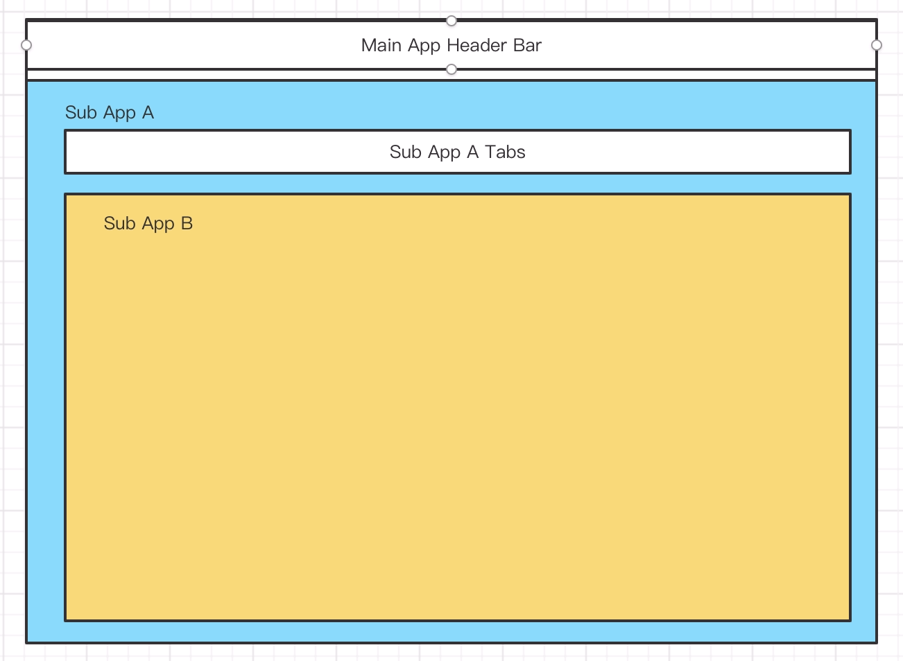

# 应用嵌套

我们先来看一个页面，这样的页面结构还是非常常见的。



就像 React Router 和 Vue Router 的路由嵌套一样，他们其实是嵌套组件，这里的嵌套结果是 App 嵌套。我们把这种嵌套和路由关联起来，他们便要实现 App Router 的路由嵌套。

### 路由插槽

假设 A 应用和 B 应用都注册了 routes. 结果如下：

```ts
const routes = [
  {
    path: '/foo',
    apps: [A]
  },
  {
    path: '/bar',
    apps: [B],
    children: [
      {
        path: '/baz',
        apps: [B],
      }
    ]
  }
]
```

我们预期访问 `/foo/bar/baz` 这个 URL 的时候展示上面的页面结构，很明显，现在不能满足要求，路由必须生成嵌套关系。

现在希望 `/bar` 作为 `/foo` 的 children，那么在 `/foo` 声明一个 slot，在 `/bar` 声明一个 fill，并且值相同，那么就可以建立嵌套关系。

- slot 是一个插槽，可以让其他具有相同 fill 名称的 route 插入这个路由的 children. 
- fill 是一个插入者，他会插入对应名称 slot 的 route 的 children。

```ts
const routes = [
  {
    path: '/foo',
    slot: 'foo-container1',
    apps: [A]
  },
  {
    path: '/bar',
    fill: 'foo-container1',
    apps: [B],
    children: [
      {
        path: '/baz',
        apps: [B],
      }
    ]
  }
]
```

我们根据相同名称 `foo-container1` 合并之后分结构如下：

```ts
const routes = [
  {
    path: '/foo',
    slot: 'foo-container1',
    apps: [A],
    children: [
      {
        path: '/bar',
        fill: 'foo-container1',
        apps: [B],
        children: [
          {
            path: '/baz',
            apps: [B],
          }
        ]
      }
    ]
  }
]
```
