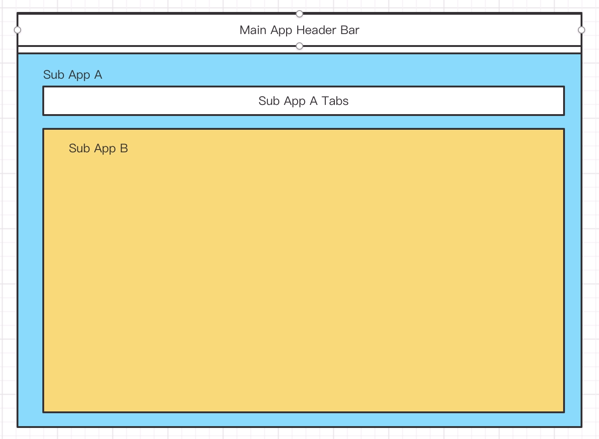

# 父容器

你或许会有两个疑点：

1. 嵌套应用什么时候开始渲染更深的子应用呢？碎片应用什么时候开始渲染呢？
2. 上面的两种应用渲染在什么 Dom 节点内部呢？如果 Dom 节点都没有渲染完成，怎么渲染子应用呢？

再看一下这张图


 
那么 B 应用应该渲染在 A 应用的哪个 Dom 节点呢？假设 A 应用内部有异步逻辑去渲染这个 Dom 节点，是否会存在渲染 B 应用的时候，A 应用的 Dom 节点还没有渲染完成？

抽象一下，这里就是两个问题

1. 父容器是谁？
2. 什么时机渲染子应用？

### 父容器是谁

#### 嵌套应用

假设我们嵌套路由结构如下：

```ts
const routes = [
  {
    path: '/foo',
    slot: 'foo-container1',
    apps: [A],
    children: [
      {
        path: '/bar',
        fill: 'foo-container1',
        apps: [B],
      },
    ],
  },
];
```

那么 B 应用应该嵌套在 A 应用内，并且 A 应用内某个 Dom 节点渲染完成后，再渲染 B 应用。

我们这里设置两个属性在 Route meta 上，分别是 `parentAppName` 和 `parentAppContainer`。

这种情况下，parentAppContainer 的默认值是 fill 的值，也就是 `fill: 'foo-container1'` 中的 `foo-container1`, 当然这个也可以注册应用的时候自己配置。

例如：
```ts
appService.registerApp({
  name: 'test',
  routes: [
    {
      path: '/test',
      meta: {
        parentAppContainer: 'my-container'
      },
    },
  ],
}),
```

```ts
const routes = [
  {
    path: '/foo',
    slot: 'foo-container1',
    apps: [A],
    children: [
      {
        path: '/bar',
        fill: 'foo-container1',
        apps: [B],
        meta: {
          parentAppName: '[App A Name]',
          // User config 是注册应用时写的，如果有则使用这个，没有则使用默认值。
          parentAppContainer: '[User config ?? foo-container1]'
        },
      },
    ],
  },
];
```

#### 碎片

```ts
const routes = [
  {
    path: '/foo',
    slot: 'foo-container1',
    apps: [A],
    children: [
      {
        path: '/bar',
        fill: 'foo-container1',
        apps: [B, C],
        meta: {
          parentAppName: '[App A Name]',
          parentAppContainer: '[User config ?? foo-container1]'
        },
      },
    ],
  },
];
```

C 应用不知道渲染在 A 应用内或者 B 应用内，也不知道是哪个容器。这种情况下只能依靠用户配置路由的时候设置。也就是注册 C 应用需要声明 `parentAppName` 和 `parentAppContainer`。

假设 C 应用与 B 应用协商好，C 应用要渲染在 B 应用内部，且约定容器名称 `b-app-test-container`，那么代码如下。

```ts
appService.registerApp({
  name: 'cName',
  routes: [
    {
      path: '/bar',
      fill: 'foo-container1',
      isFragment: true,
      meta: {
        parentAppName: '[App B Name]',
        parentAppContainer: 'b-app-test-container',
      },
    },
  ],
});
```

那么生成之后的 routes 结构如下。

```ts
const routes = [
  {
    path: '/foo',
    slot: 'foo-container1',
    apps: [A],
    children: [
      {
        path: '/bar',
        fill: 'foo-container1',
        apps: [B, C],
        meta: {
          parentAppName: '[App A Name]',
          parentAppContainer: '[User config ?? foo-container1]',
          cName: {
            parentAppName: '[App B Name]',
            parentAppContainer: 'b-app-test-container',
          },
        },
      },
    ],
  },
];
```

我们通过这种设计，很容易知道父容器是谁。

### 什么时机渲染子应用

A 应用的渲染时机没有疑问，问题是什么时候渲染 B。这个时机只有 B 应用内部知道他的 Dom 是否渲染完成，因此需要 B 应用通知我们。

```ts
class App {
  constructor(config) {
    this.name = config.name;
    this.load = config.loadApp;
  }

  async mount() {
    const res = await this._lifeCycle.mount(this._getProps(context));
    this.containerController = res?.containerController;
  }

  async waitForContainer(containerName: string) {
    await this.containerController.wait(containerName);
  }
}

function loadScript(url: string) {
  // 加载 js 资源文件
}

const foo = new App({
  name: 'foo',
  loadApp: () => {
    loadScript('https://xxx.xxx.xxx/xxx.js');
  },
});

// file: https://xxx.xxx.xxx/xxx.js
// export function mount() {
//   document.getElementById('foo').innerHTML = '<div>hello world</div>';
//   return {
//     containerController: {
//       async wait(containerName: string) {
//         // await domLoaded
//       }
//     }
//   }
// }

foo.load();
```

在 mount 的时候返回一个具有 containerController 属性的对象，用于通知主应用。因此 A 应用也只要返回这个对象就行。渲染 B 应用的时候，调用 A 应用的 waitForContainer 方法，参数是 B 应用设置的 parentAppContainer。
这样 A 应用的 Dom 节点渲染完成后才会渲染 B 应用。
