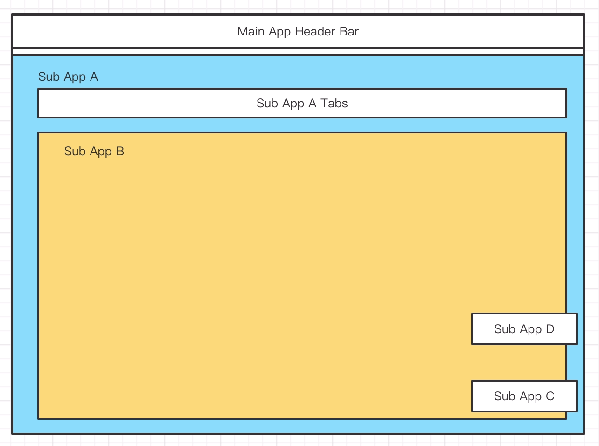

# 根节点碎片

在理解根节点碎片之前，我们先看一个页面



应用 C 和应用 D 渲染在主应用内，悬浮于右侧。C 和 D 在某些页面需要展示。

应用 C 和 应用 D 和[应用嵌套](./nested-routes.md) 那里提到的应用 A 和 应用  B 有本质区别，不需要走之前的路由逻辑，我们只需要简单匹配，渲染在某些页面就行。我们把这种应用叫做根节点碎片应用。他是一种渲染在主应用内的子应用，但是不跟随主体路由树做路由匹配来激活他，他有自己的激活规则。

他注册之后路由结构如下：

```ts
const rootFragments = [
  {
    path: '/(.*)',
    apps: [C]
  },
  {
    path: '/foo',
    apps: [D]
  },
  {
    path: '/foo',
    apps: [E]
  },
]
```

这里即使有相同路由，也不会合并，因为 `rootFragments` 路由并不会生成树结构，他是将所有可以匹配的应用全部激活。

因此，上面的路由结构，进入 `/foo` 会激活应用 C，应用 D，应用 E；进入 `/bar` 会激活 C。
