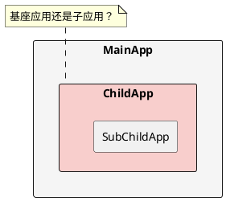
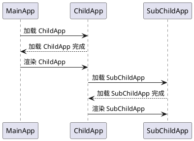
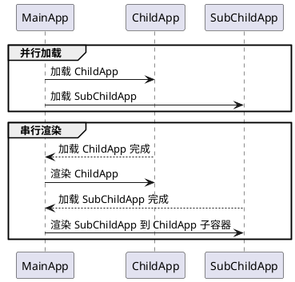
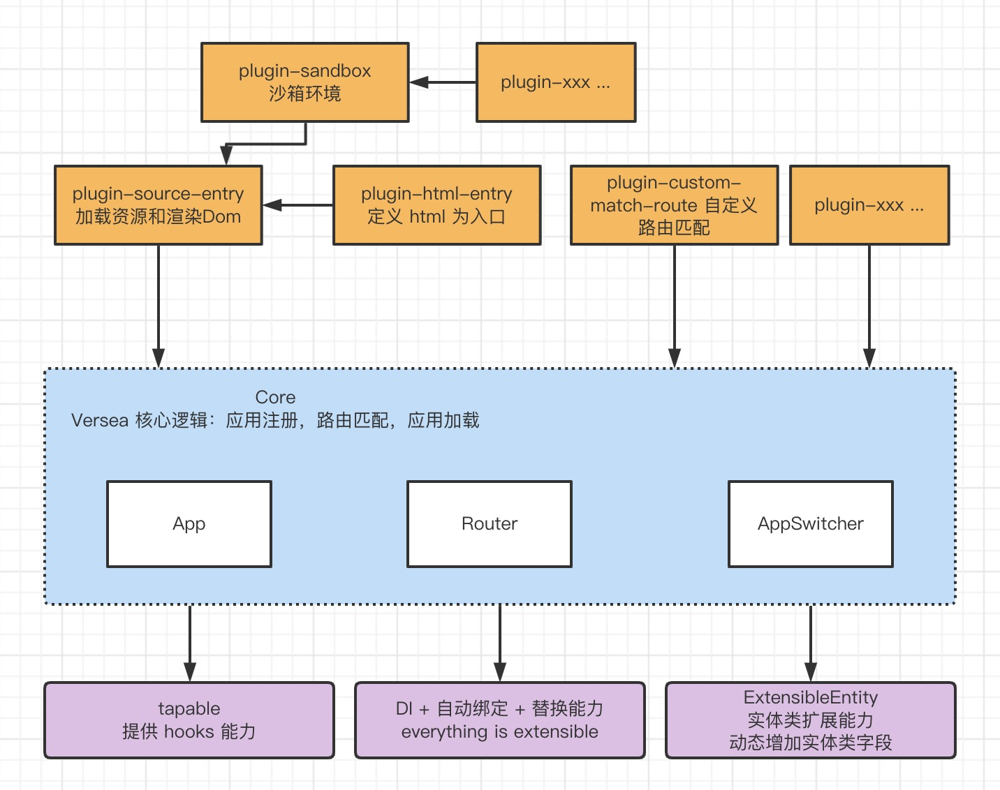

# 简介

versea 是一个微前端框架

### 现状

现阶段微前端的能力有以下不足：

1. 嵌套能力弱。虽然各种框架都有实现嵌套能力，但是普遍存在多级基座的问题，如下图所示，`ChildApp` 既是 `MainApp` 的子应用，也是 `SubChildApp` 的主应用，是一个二级基座，这样的设计造成信息在 `MainApp` 丢失，如：`MainApp` 无法直接决定 `SubChildApp` 在在哪个页面渲染，是否需要渲染。这样的场景通常出现在权限和404 设计中。

1. 嵌套情况下，加载速度不如预期

预期如下:

1. 插件能力不足
目前微前端普遍只有 dispatch Event，但是无法改变加载和渲染行为。因此只能获取事件，但是无法增加插件，也就完成修改加载顺序，自定义沙箱这样的需求。

### 目标

1. 微前端加载应用，渲染，销毁能力。
2. 单主应用，不存在二级基座。
3. versea 路由匹配和拦截。双路由配置，versea 路由决定加载应用，应用路由决定加载组件。
4. 插件能力，类似 webpack 的插件能力。
5. 扩展能力，可以扩展任何代码，包括 versea 核心逻辑，深度用户可以基于此框架开发自己特定需求的微前端框架。

### 架构

- 底层能力：插件能力，扩展能力。
- core: versea 核心逻辑，应用注册，路由匹配，应用加载。
- plugin-xxx: 插件是可选项，用户选择自己需要的插件。

> DI: 依赖注入。
> 替换能力：深度使用者可以自己重写任何一个函数，实现整个框架所有内容均可扩展，包括依赖注入类型的插件。
