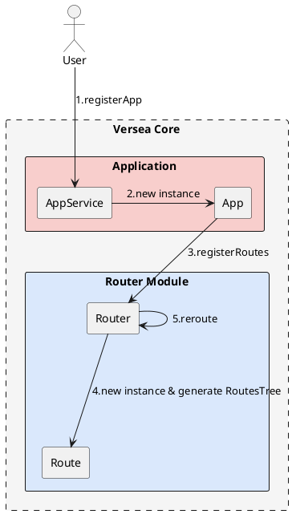
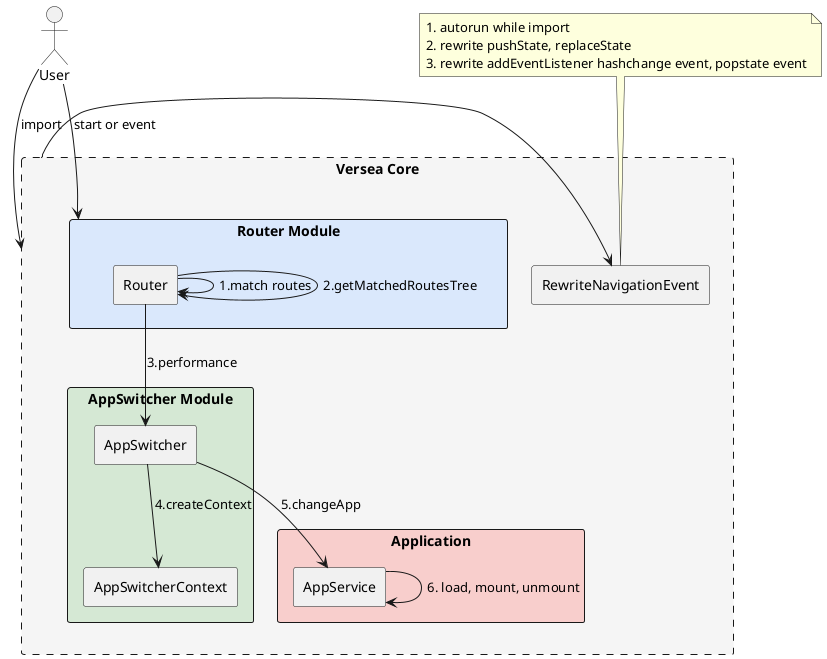

# versea 架构

### 注册 App 流程

AppService 有一个重要的方法是 registerApp，registerApp 会生成 App 的实例，并把 registerApp 创建时传入的路由信息传给 Router 创建 Route 的实例，生成 RoutesTree。后续会用这个 RoutesTree 做路由匹配。

### reroute 流程

reroute 流程较为复杂，是整个 versea/core 的核心，控制整个应用加载，卸载流程，这里重点介绍一下 AppSwitcherContext，它需要记录 App 的加载顺序，mount 顺序和卸载顺序。当 changeApp 触发时，会生成一个新的 AppSwitcherContext。然后销毁当前的 AppSwitcherContext，使用新的 AppSwitcherContext 替代它。

### Hooks

hooks 仅仅是在上述流程中增加一些前置和后置操作，常见的 hooks 如下

1. beforeRegister
2. Registered
3. matchRoutes
4. getRoutesTree
5. createContent
6. beforeLoad
7. loaded
8. beforeMount
9. mounted
10. beforeUnmount
11. unmounted

另外，提供一个 HookContext 也是很重要的，这样才能保证使用者很方便使用 hooks

### Plugins

同 Hooks 一样，这里需要有一个 PluginContext，方便取各种 service

### versea 支持的模型
